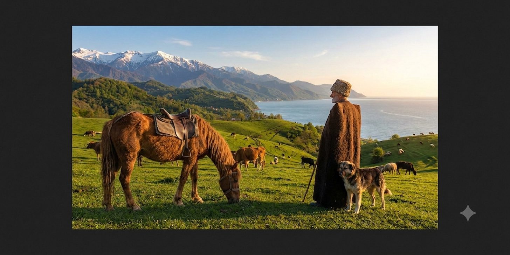
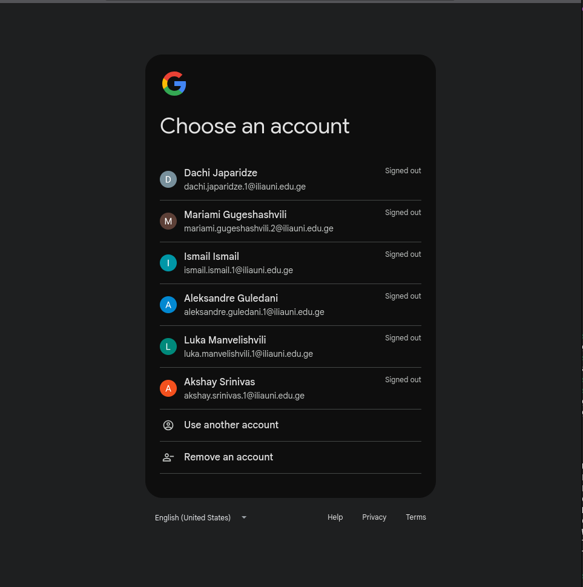
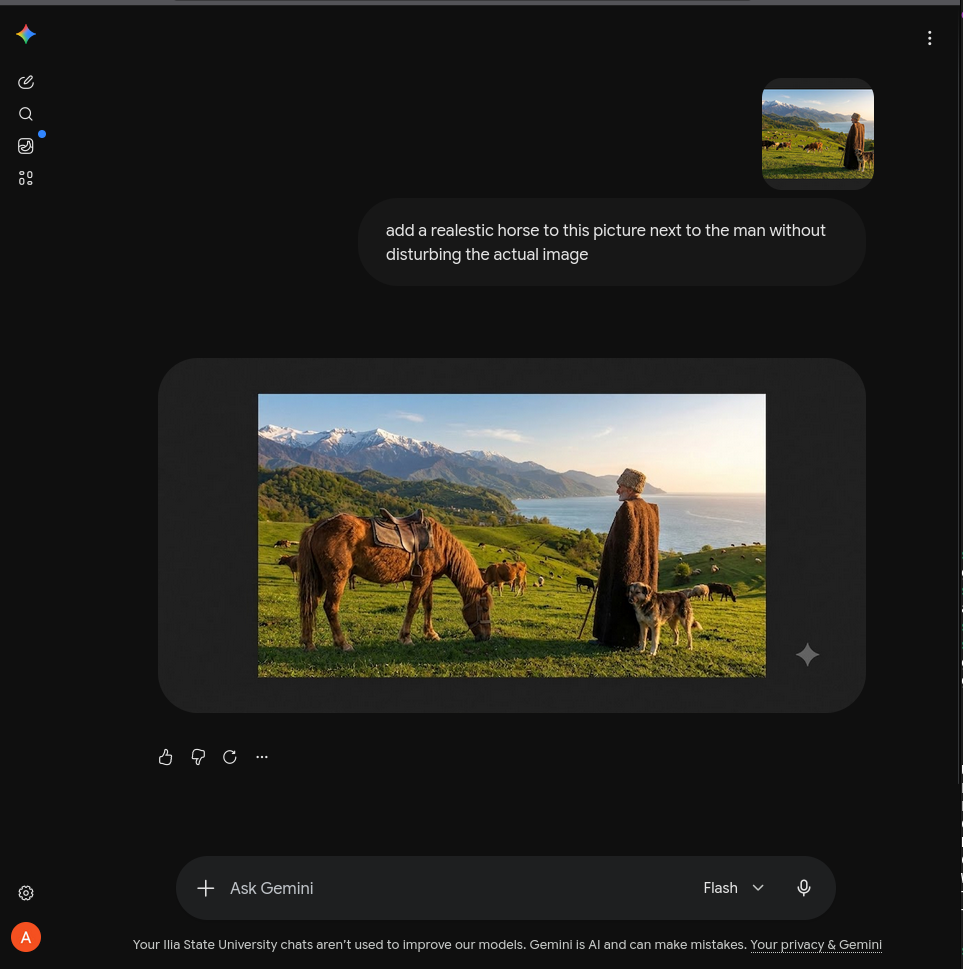

# Introduction to AI — Final Exam Answers

## Task 1: Adding a Horse to the Picture

## Task 2: User Manual — Adding a Horse Using Google Gemini

This manual explains how to sign up for Google Gemini and use it to add a horse to a picture.

### Step 1: Go to Gemini
Visit [gemini.google.com](https://gemini.google.com). You'll see the landing page.

### Step 2: Sign in with your Google account
Click **Sign in** in the top right corner. Choose your Google account from the list (or add a new one if you don't have one yet — any Google account works, including a university account).

### Step 3: You're signed in
Once signed in, Gemini greets you with a personalized prompt box, ready to accept text and images.

### Step 4: Upload the picture and describe the edit
Click the **+** icon next to the input box and upload the template picture. Then type a clear instruction describing what you want changed — for example:

> *"add a realistic horse to this picture next to the man without disturbing the actual image"*

Press enter. Gemini generates the edited image directly in the chat.

### Step 5: Review and download the result
Gemini returns the picture with the horse added, keeping the rest of the scene intact. Right-click the image and select "Save image as..." to download it.

That's it — the final image is ready to use.
